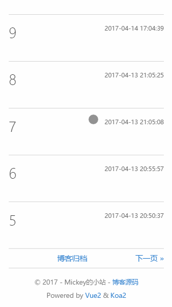

# Blog
A blog system. Based on Vue2, Koa2, MongoDB...

前后端分离项目的博客系统，前端SPA + 后端RESTful服务器

## 更新日志

> 2017/04/03：完成前端展示界面View级组件的编写
>
> 2017/04/04：将前端页面路由部署完毕，编写完博客后台管理界面View级组件，将后端管理平台的路由部署完毕
>
> 2017/04/05：完善博客管理平台消息通知系统，增加页面载入进度条，编写管理平台登录界面，开始编写后台restful接口
> 
> 2017/04/06：大致完成Restful接口tag部分，前端部署Vuex，完成前端和后台关于tag的数据交互
>
> 2017/04/07：完成博客后台管理平台和后端的数据通信，根据Vuex完善部分组件内部数据
>
> 2017/04/08：完成博客前端显示界面和后台的数据通信，去除两个界面sass的scoped标签使得v-html动态添加的内容能够着上样式，明天修改后台管理平台左边nav的active问题和前端query分页问题
>
> 2017/04/09：完成博客管理平台的密码登录和验证
>
> 2017/04/10：完成前端博客界面每篇文章的目录显示，兼容移动端，原理是采用正则表达式进行匹配
>
> 2017/04/11：完成文章页面跳转上一篇和下一篇文章的功能，修复博客文章目录float的bug
>
> 2017/04/12：修复后台管理平台左边nav刷新时候active不正确的bug，使用了:default-active
>
> 2017/04/13：修复博客管理平台几个bug，博客前端界面增加分页，一页最多10篇文章
>
> 2017/04/14：修复从博客管理界面点击查看错误路由bug，博客管理界面增加分页，一页最多12篇文章，为博客编辑界面添加样式，需要去掉scoped才能使得动态添加上去的元素获得样式
>
> 2017/04/15：跨域cookie获取失败，目前使用H5的sessionStorage来设置登录信息
>
> 2017/04/17：修复部分bug，编写readme
>
> 2017/04/26：使用highlightjs增加代码块高亮功能，增加博客界面小按钮点击返回顶部(滚动显示)
>
> 2017/04/27：修复由小屏幕点开侧边导航栏拉大屏幕宽度至大屏幕导航栏显示异常bug，增加user-scalable=0禁止移动端双击扩大页面，修改代码块显示为黑底白字（信仰！）
>
> 2017/04/29：本来想用cluster来利用多核cpu，然后就发现了pm2，简直热泪盈眶，相见恨晚(后排加鸡腿)
>
> 2017/04/30：学习redis，明天正式投入使用
>
> 2017/05/02：后台增加redis缓存
## 特点
* 支持markdown编写
* 兼容各种设备
* 清新简约的风格

## 功能特点显示
* pc端博客界面


* 移动端博客界面



* pc端博客管理平台


## 编写使用工具

**前端工具**

* Vue2.0
* Vue-Router
* Vuex
* axios
* element-ui
* sublime

前端兼容了pc端和移动端，使用了flexbox布局，关于flexbox请阅读[一个完整的Flexbox指南](http://www.w3cplus.com/css3/a-guide-to-flexbox-new.html)以及这篇最新的[理解Flexbox：你需要知道的一切](http://www.w3cplus.com/css3/understanding-flexbox-everything-you-need-to-know.html)

本项目还采用了手机端适配，关于移动端的学习资料请按照我下面罗列的资料按顺序仔细阅读。

1. [移动端调试](https://segmentfault.com/a/1190000002565572)
2. [介绍vieport](http://www.css88.com/archives/6410)
4. [使用Flexible实现手淘H5页面的终端适配](https://github.com/amfe/article/issues/17)


**后端工具**

* Koa全家桶
* vscode
* pm2

后端的管理界面我直接使用了[element ui](http://element.eleme.io/#/)这个基于vue的组件库，很强大

## 目录结构

```

│  README.md
│  
├─client
│  │  .babelrc
│  │  .gitignore
│  │  index.html
│  │  package.json
│  │  webpack.config.js
│  │  
│  └─src
│      │  main.js
│      │  
│      ├─api
│      │      dealTime.js
│      │      generateTree.js
│      │      
│      ├─assets
│      │      avatar.jpg
│      │      loginBg.jpg
│      │      sideBar.jpg
│      │      webp.ico
│      │      
│      ├─components
│      │  │  App.vue
│      │  │  
│      │  ├─admin
│      │  │      Account.vue
│      │  │      ArticleEdit.vue
│      │  │      ArticleList.vue
│      │  │      Back.vue
│      │  │      LabelManage.vue
│      │  │      Login.vue
│      │  │      Overview.vue
│      │  │      
│      │  └─front
│      │          About.vue
│      │          Archive.vue
│      │          Article.vue
│      │          ArticleList.vue
│      │          Front.vue
│      │          Index.vue
│      │          LabelContent.vue
│      │          Pagination.vue
│      │          SideBar.vue
│      │          SmallLabel.vue
│      │          
│      ├─css
│      │      animate.css
│      │      font-awesome.min.css
│      │      
│      ├─fonts
│      │      fontawesome-webfont.eot
│      │      fontawesome-webfont.svg
│      │      fontawesome-webfont.ttf
│      │      fontawesome-webfont.woff
│      │      fontawesome-webfont.woff2
│      │      FontAwesome.otf
│      │      
│      ├─router
│      │      admin.js
│      │      front.js
│      │      index.js
│      │      
│      ├─sass
│      │  ├─admin
│      │  │      account.scss
│      │  │      articleEdit.scss
│      │  │      back.scss
│      │  │      login.scss
│      │  │      overview.scss
│      │  │      
│      │  └─front
│      │          about.scss
│      │          archive.scss
│      │          article.scss
│      │          articleList.scss
│      │          front.scss
│      │          general.scss
│      │          labelContent.scss
│      │          pagination.scss
│      │          sideBar.scss
│      │          smallLabel.scss
│      │          
│      └─store
│              index.js                 
└─server
    │  app.js
    │  controller.js
    │  package.json
    │  start.js
    │  前后端通信api.txt
    │  
    ├─.vscode
    │      launch.json
    │      
    ├─api
    │      index.js
    │      
    ├─controllers
    │      account.js
    │      article.js
    │      tag.js
    │      
    ├─model
    │      mongo.js
    │      
    └─model_rest
            accountAction.js
            articleAction.js
            tagAction.js

```

## Step

**环境**

* Node.js V6
* MongoDB(Mongoose)
* 推荐[Robomongo](https://robomongo.org/)作为数据库的可视化管理工具
* 使用pm2管理 npm install pm2 -g

**克隆远程库**

git clone git@github.com:mickey0524/Blog.git

**安装前后端依赖**

克隆后在client和server目录下执行npm install命令

**启动后端服务器**

进入到server文件夹下: node start.js

**启动前端项目**

进入到client文件夹下: npm run dev / pm2 start start.js -i 4

**生成发布**

npm run build

## License

MIT

